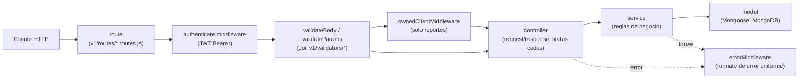
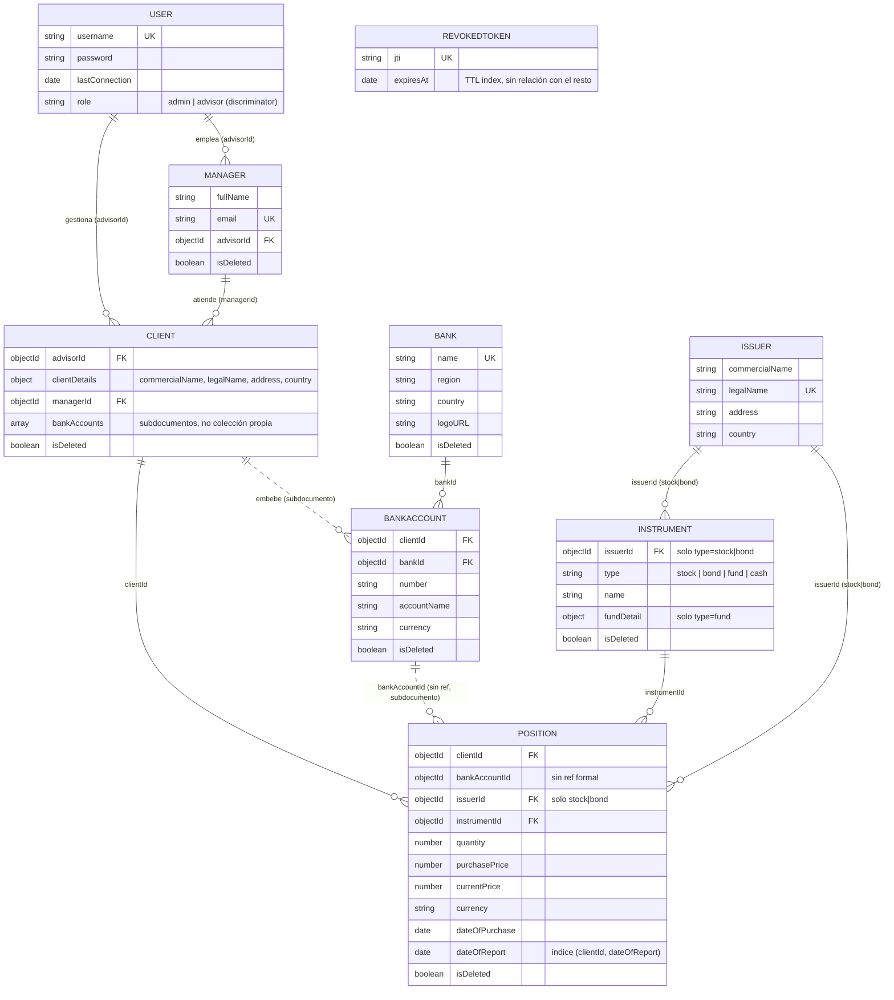

# Abakus API — Consolidación de cuentas financieras

API REST para que una empresa gestora / asesor de inversiones (`advisor`)
centralice, para cada uno de sus clientes (`Client`), las posiciones que
ese cliente tiene distribuidas en distintas cuentas bancarias (`bankAccounts`,
embebidas en `Client`) y en distintos bancos (`Bank`): alta de instrumentos (acciones, bonos,
fondos, efectivo), asignación de cada cliente a un ejecutivo de cuenta (`Manager`),
reportes consolidados por cliente, consolidación multi-moneda contra una API de tipo de
cambio de terceros, y un análisis de la cartera asistido por IA generativa.
Ver [`documentation/requerimientos-api.md`](documentation/requerimientos-api.md)
para el detalle del dominio y [`documentation/evaluacion-de-propuesta.md`](documentation/evaluacion-de-propuesta.md)
para el porqué de cada decisión.

- **Producto:** API REST versionada (`/v1`), publicada.
- **Materia:** Desarrollo Full Stack integrado con IA — Universidad ORT Uruguay.
- **Entrega:** Obligatorio 1 (backend). El frontend se desarrolla en el Obligatorio 2.

| | |
| --- | --- |
| API publicada | _pendiente de deploy_ |
| Colección de Postman | [`documentation/postman/`](documentation/postman/) _(por ahora solo `auth`)_ |
| Endpoints | [`documentation/endpoints.md`](documentation/endpoints.md) |
| Requerimientos | [`documentation/requerimientos-api.md`](documentation/requerimientos-api.md) |

---

## Estado del proyecto

En desarrollo. El repositorio ya tiene el flujo completo `route → validator →
controller → service → model` para la mayoría de los recursos del dominio.
Ver el detalle funcional y los criterios de aceptación en
[`documentation/requerimientos-api.md`](documentation/requerimientos-api.md),
y el modelo de datos actual (con diagramas) en [Modelo de dominio](#modelo-de-dominio) más abajo.

| Área | Estado |
| --- | --- |
| Scaffold Express + ruteo `/v1` | ✅ |
| Conexión a MongoDB (Mongoose) | ✅ |
| Modelos: `User`/`Admin`/`Advisor`, `Manager`, `Client`, `Bank`, `Instrument`, `Issuer`, `Position` | ✅ (`Client.bankAccounts` embebido, no colección propia — ver [Modelo de dominio](#modelo-de-dominio)) |
| Middleware de autenticación (verifica el JWT `Bearer`) | ✅ |
| Registro / login (emisión de JWT) | ✅ |
| Logout | 🟨 (`logoutUser` y `routes/user.routes.js` existen, pero el router no está montado en `v1.routes.js`) |
| ABM de Bancos (`/v1/bank`) | ✅ |
| ABM de Clientes (`/v1/client`) | ✅ |
| ABM de Ejecutivos de cuenta (`/v1/manager`) | ✅ |
| ABM de Instrumentos (`/v1/instrument`) | ✅ |
| ABM de Emisores (`/v1/issuer`) | ✅ |
| ABM de Posiciones (`/v1/position`) | ✅ |
| Reportes por cliente (`/v1/report/client/:clientId/...`) | 🟨 (completo, composición, histórico, por instrumento y por emisor; todos los montos se tratan como USD hasta integrar FX — ver [Reportes](#reportes)) |
| Control de acceso a clientes propios (`ownedClientMiddleware`) | ✅ (aplicado en reportes) |
| ABM de Cuentas bancarias como colección propia (`BankAccount`, límite por plan) | ⬜ (hoy son subdocumentos de `Client`, sin límite de plan aplicado) |
| Subida de imágenes a Cloudinary (`/v1/uploads`) | ✅ (endpoint genérico; todavía no se asocia a `Bank.logoURL` automáticamente) |
| Scripts de seed (admins y datos de demo) | ✅ (ver [Scripts](#scripts)) |
| Integración API de FX (terceros) | ⬜ |
| Endpoint de IA generativa (análisis de cartera consolidada) | ⬜ |
| Colección y tests de Postman | 🟨 (solo `auth`) |
| Deploy en Vercel | ⬜ |

---

## Stack tecnológico

- **Runtime:** Node.js 20 LTS (ES Modules)
- **Framework:** Express 5
- **Base de datos:** MongoDB + Mongoose
- **Autenticación:** JWT (`jsonwebtoken`) + hashing con `bcryptjs`
- **Validación:** Joi (validación de entrada duplicada en el backend)
- **Almacenamiento de imágenes:** Cloudinary (subida en memoria con `multer`)
- **IA generativa:** Groq vía API (flujo interno, no chat)
- **Datos de mercado:** API de FX de terceros (Frankfurter) con caché; OpenFIGI para identificación de instrumentos
- **Deploy:** Vercel
- **Documentación y tests de endpoints:** Postman
- **Calidad de código:** ESLint (`npm run lint`)

> `mongoose`, `jsonwebtoken`, `joi`, `bcryptjs`, `cloudinary`, `multer` y `cors`
> ya están instalados (`package.json`); falta agregar el cliente del proveedor
> de IA generativa cuando se implemente ese flujo.

---

## Requisitos previos

- Node.js ≥ 20
- npm ≥ 10
- Una instancia de MongoDB (local o MongoDB Atlas)

---

## Instalación y ejecución

```bash
# 1. Instalar dependencias
npm install

# 2. Crear el archivo .env en la raíz
#   con las variables de la tabla más abajo

# 3. (opcional) Cargar admins y datos de demo — ver "Scripts"
node scripts/seed-data.js

# 4. Levantar en modo desarrollo (recarga con nodemon)
npm run dev

# 4'. o en modo producción
npm start
```

La API queda disponible en `http://localhost:3000/v1`.

---

## Scripts

| Comando | Qué hace |
| --- | --- |
| `npm run dev` | Levanta el servidor con `nodemon` |
| `npm start` | Levanta el servidor con `node` |
| `npm run lint` / `npm run lint:fix` | Corre ESLint (y aplica correcciones automáticas) |
| `ADMIN_SEED_PASSWORD=<pwd> node scripts/seed-admins.js <user> [<user> ...]` | Crea usuarios `admin` (no pueden auto-registrarse, RF11). Omite los usernames que ya existen |
| `node scripts/seed-data.js` | Carga un advisor de demo (`demo.advisor`), bancos, emisores, instrumentos, clientes, managers y posiciones. Idempotente: borra los datos de demo previos antes de recrearlos |

---

## Variables de entorno

Definidas en `.env` (no se versiona).

| Variable | Descripción | Ejemplo |
| --- | --- | --- |
| `PORT` | Puerto del servidor HTTP | `3000` |
| `MONGODB_URI` | Cadena de conexión a MongoDB | `mongodb://localhost:27017/abakus` |
| `MONGO_DUPLICATE_KEY` | Código de error de MongoDB para clave duplicada (se usa al registrar usuarios) | `11000` |
| `SALT_ROUNDS` | Rondas de `bcrypt` para hashear contraseñas | `10` |
| `JWT_SECRET` | Secreto para firmar los tokens | `una-clave-larga-y-aleatoria` |
| `JWT_EXPIRES_IN` | Vigencia del token | `1d` |
| `BASE_PLAN_ACCOUNT_LIMIT` | Máx. de `BankAccount` para el plan `base` (la letra lo llama `plus`; ver nota en `requerimientos-api.md`) — aún no se aplica | `4` |
| `CLOUDINARY_CLOUD_NAME` | Cloud name de Cloudinary | — |
| `CLOUDINARY_API_KEY` | API key de Cloudinary | — |
| `CLOUDINARY_API_SECRET` | API secret de Cloudinary | — |
| `MARKET_API_BASE_URL` | Base URL del proveedor de cotizaciones | `https://api.frankfurter.app` |
| `MARKET_API_KEY` | API key del proveedor de cotizaciones (si aplica) | — |
| `MARKET_CACHE_TTL_SECONDS` | TTL del caché de cotizaciones | `300` |
| `GROQ_API_KEY` | API key de Groq (IA generativa) | — |
| `OPEN_FIGI_API_KEY` | API key de OpenFIGI | — |
| `ADMIN_SEED_PASSWORD` | Solo para `scripts/seed-admins.js`: contraseña de los admins creados | — |

---

## Estructura del proyecto

```
.
├── app.js                 # Configuración de Express y montaje de middlewares/rutas
├── server.js              # Punto de entrada: levanta el servidor HTTP
├── v1/                    # Versión 1 de la API
│   ├── v1.routes.js       # Router raíz de /v1; monta los routers de cada recurso
│   ├── config/            # Conexión a MongoDB y cliente de Cloudinary
│   ├── models/            # Esquemas Mongoose (User/Admin/Advisor, Manager, Client, Bank, Instrument, Issuer, Position, RevokedToken)
│   ├── routes/            # Un router por recurso (auth, bank, client, instrument, issuer, manager, position, report, uploads)
│   ├── controllers/       # Manejo de request/response por endpoint
│   ├── services/          # Lógica de negocio y acceso a datos (Mongoose)
│   ├── validators/        # Esquemas Joi de validación de entrada (body y params)
│   ├── middlewares/       # authenticate (JWT), validatedBody, validatedParams, ownedClient,
│   │                      # multer, requestLogger, notFound, error
│   └── utils/             # Errores HTTP, fechas, cálculos monetarios, armado de reportes, helpers de upload
├── scripts/               # Seeds: seed-admins.js, seed-data.js
├── documentation/         # Letra (PDF), requerimientos de API y cliente, endpoints,
│                          # evaluación de la propuesta y colección de Postman (postman/)
└── README.md
```

> Convención de capas: `route → middleware(s) → controller → service → model`.
> Los controllers no acceden directamente a la base; la lógica de negocio vive en
> `services/` y el acceso a datos en `models/` (Mongoose).



---

## Modelo de dominio

La letra del obligatorio y los requerimientos ([`documentation/requerimientos-api.md`](documentation/requerimientos-api.md))
usan nombres en español que no siempre coinciden literalmente con los
identificadores del código (en inglés, por convención del curso). Tabla de
equivalencia:

| Término (letra / dominio) | Entidad en código (`v1/models/`) | Nota |
| --- | --- | --- |
| Usuario común | `User` con discriminador `role: "advisor"` (`Advisor`) | la letra dice `user`, el código usa `advisor` |
| Administrador | `User` con discriminador `role: "admin"` (`Admin`) | catálogo de bancos/emisores |
| Empresa / cliente del asesor | `Client` | sin login propio; `advisorId` la vincula a su `Advisor` |
| Ejecutivo de cuenta | `Manager` | empleado del `Advisor` (sin login propio); cada `Client` tiene un `managerId`, un `Manager` puede atender varios clientes |
| Banco (categoría) | `Bank` | catálogo, alta reservada a `admin` |
| Cuenta bancaria | `Client.bankAccounts[]` (subdocumento embebido) | no es colección propia — ver limitación abajo |
| Emisor de un instrumento | `Issuer` | acción/corporación o gobierno; distinto de `Client` |
| Instrumento financiero | `Instrument` | tipo único con discriminación por `type` (`stock`\|`bond`\|`fund`\|`cash`) |
| Posición | `Position` | tenencia de un `Instrument` en una `bankAccount` de un `Client`, con cantidad y precios |
| Plan `plus` | `Advisor.planTier: "premium"` | la letra dice `plus`, el modelo usa `premium` |

> Ver también las notas de mapeo en [`documentation/endpoints.md`](documentation/endpoints.md) § 0.

### Diagrama entidad-relación

Refleja el estado **actual** de `v1/models/*.model.js` (no el modelo aspiracional
completo de la letra — para ese detalle ver `requerimientos-api.md` § Modelo de
datos). Líneas sólidas = relación con `ref` de Mongoose; líneas punteadas =
vínculo por convención (sin `ref` ni colección propia del lado referenciado).



### Jerarquía de `User` (discriminadores de Mongoose)

`Admin` y `Advisor` no son colecciones separadas: comparten la colección
`users` y Mongoose las distingue por el campo `role`. Un diagrama de clases
representa mejor esa herencia que el ER de arriba:

```mermaid
classDiagram
    class User {
        +string username
        +string password
        +Date lastConnection
        +string role
    }
    class Admin
    class Advisor {
        +AdvisorDetails details
        +string planTier
    }
    User <|-- Admin
    User <|-- Advisor
    note for Admin "discriminador role = \"admin\""
    note for Advisor "discriminador role = \"advisor\""
    class AdvisorDetails {
        +string comercialName
        +string legalName
        +string document
        +string phone
        +string contactEmail
    }
    Advisor --> AdvisorDetails
```

### Limitación conocida: `BankAccount` embebida

`Position.bankAccountId` apunta a un subdocumento dentro de `Client.bankAccounts[]`,
no a una colección propia — por eso no tiene `ref` en el schema. Implicancias:
no se puede hacer `findById`/`populate` directo sobre una cuenta sin conocer
antes a qué `Client` pertenece, actualizar una sola cuenta implica reenviar el
arreglo completo (`findOneAndUpdate` reemplaza el arreglo, no lo mergea), y no
hay forma simple de garantizar `number` único entre clientes. Se mantiene así
porque cada `Client` tiene, en la práctica, un puñado de cuentas (no es una
regla de negocio, solo el dato observado); si eso cambia, migrar a una
colección `BankAccount` independiente referenciada por `clientId` es la salida
natural.

---

## Reportes

Todos los reportes son `GET`, requieren JWT y se calculan sobre las posiciones
de un único cliente:

| Endpoint | Reporte |
| --- | --- |
| `/v1/report/client/:clientId` | Reporte completo: posiciones del mes, totales (costo, valor de mercado, resultado no realizado) y composición |
| `/v1/report/client/:clientId/composition` | Totales y distribución de la cartera por tipo de instrumento, instrumento y emisor |
| `/v1/report/client/:clientId/historic` | Totales por mes, variación del valor de mercado contra el mes anterior y distribución por tipo de instrumento |
| `/v1/report/client/:clientId/instrument/:instrumentId` | Posiciones en un instrumento, su peso en la cartera y reparto por cuenta bancaria |
| `/v1/report/client/:clientId/issuer/:issuerId` | Posiciones de un emisor, su peso en la cartera y reparto por instrumento |

Reglas:

- **Acceso:** `ownedClientMiddleware` carga el cliente y verifica que un
  `advisor` solo acceda a sus propios clientes; si el cliente es de otro
  advisor se responde **404** (no 403), para no revelar su existencia. Un
  `admin` puede consultar cualquier cliente.
- **Vigencia:** salvo el histórico, los reportes usan solo las posiciones
  informadas en el mes corriente (`dateOfReport`).
- **Moneda:** por ahora todos los montos se tratan como USD; la conversión
  multi-moneda llega con la integración de FX.
- **Redondeo:** los porcentajes se redondean con el método del mayor resto,
  para que la suma siga dando el total (`v1/utils/math.js`).

---

## Subida de imágenes

`POST /v1/uploads` (requiere JWT) recibe un `multipart/form-data` con el archivo
en el campo `imagen` y, opcionalmente, `folder` (por defecto `uploads`). El
archivo se mantiene en memoria y se sube a Cloudinary; la respuesta devuelve
`{ url, folder }`, pensada para guardarse luego en campos como `Bank.logoURL`.

---

## Versionado de la API

Todo el ruteo cuelga de `/v1`. Nuevas versiones se montan en paralelo
(`/v2`, ...) sin romper la anterior:

```js
// app.js
app.use("/v1", v1Routes);
// app.use("/v2", v2Routes);  // futuro
```

---

## Testing

Los endpoints se documentan y prueban con **Postman**:

- Una única colección que agrupa carpetas por recurso.
- Un request por endpoint, con tests para **cada status code** que devuelve.
- Variable de colección `prod_base_url` apuntando a la API publicada.

La colección exportada (JSON) se versiona en [`documentation/`](documentation/).

---

## Deploy

Deploy en **Vercel**. La URL pública se documenta en la tabla del inicio de este
README y en el archivo de entrega.

---

## Nota sobre robustez y alcance

Este proyecto es una **prueba de concepto / MVP** con fines académicos y de
demostración de producto. El stack (Node.js + JavaScript sin tipado estático +
MongoDB) **no es el idóneo para un sistema financiero real**.

Una versión productiva debería, como mínimo:

- Migrar la aritmética monetaria a **decimales de precisión arbitraria**
  (`decimal.js` / `big.js`); nunca `number`/floating point para dinero.
- Adoptar **tipado estático** (TypeScript en modo estricto como primer paso;
  para el núcleo de dinero y transacciones, un lenguaje fuertemente tipado y con
  garantías más fuertes — Go, Kotlin/JVM, C#).
- Separar el **sistema de registro** (transacciones, saldos, auditoría → base
  relacional **PostgreSQL** con ACID y log inmutable) de la **capa de API /
  presentación** (aceptable en Node/TS).
- Validación de esquema en la base, **observabilidad** (logs estructurados,
  métricas, trazas) y una suite de **tests automatizados** en CI.
- Encuadrar el análisis de IA como **informativo/educativo**, no como
  asesoramiento de inversión (implicancias regulatorias).

---

## Autores

- Franco Rossi
- Victoria Martinez

Universidad ORT Uruguay — Analista en Tecnologías de la Información / Analista Programador.

## Licencia

ISC. Uso académico.
