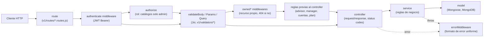
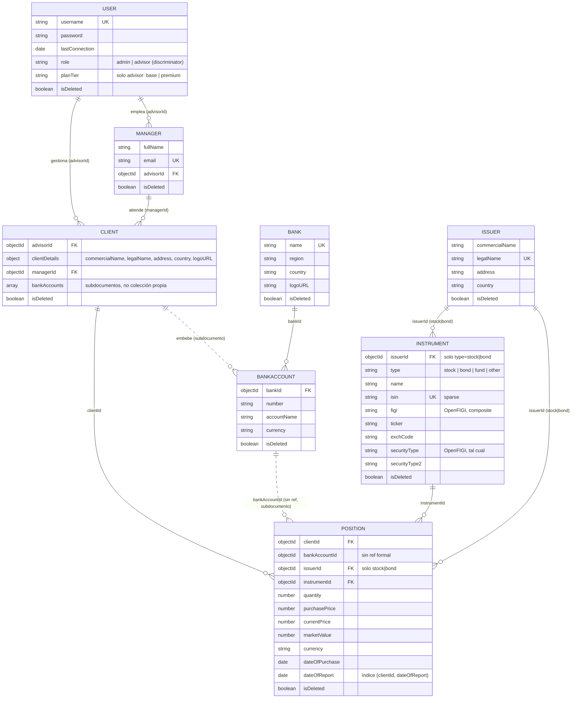

# Abakus API — Consolidación de cuentas financieras

API REST para que una empresa gestora / asesor de inversiones (`advisor`)
centralice, para cada uno de sus clientes (`Client`), las posiciones que
ese cliente tiene distribuidas en distintas cuentas bancarias (`bankAccounts`,
embebidas en `Client`) y en distintos bancos (`Bank`): alta de instrumentos (acciones, bonos,
fondos, efectivo), asignación de cada cliente a un ejecutivo de cuenta (`Manager`),
reportes consolidados por cliente, planes con límite de clientes y cuentas (`base` /
`premium`), y un análisis de noticias de la cartera asistido por IA generativa.
Ver [`documentation/requerimientos-api.md`](documentation/requerimientos-api.md)
para el detalle del dominio y [`documentation/evaluacion-de-propuesta.md`](documentation/evaluacion-de-propuesta.md)
para el porqué de cada decisión.

- **Producto:** API REST versionada (`/v1`), publicada.
- **Materia:** Desarrollo Full Stack integrado con IA — Universidad ORT Uruguay.
- **Entrega:** Obligatorio 1 (backend). El frontend se desarrolla en el Obligatorio 2.

| | |
| --- | --- |
| API publicada | [Abakus en Vercel](https://abakus-gamma.vercel.app) — base de endpoints: `/v1` |
| Colección de Postman | [`documentation/postman/abakus.postman_collection.json`](documentation/postman/abakus.postman_collection.json) |
| Endpoints | [`documentation/endpoints.md`](documentation/endpoints.md) |
| Requerimientos | [`documentation/requerimientos-api.md`](documentation/requerimientos-api.md) |

---

## Estado del proyecto

Todos los recursos del dominio tienen el
flujo completo `route → middleware(s) → controller → service → model`.
Ver el detalle funcional y los criterios de aceptación en
[`documentation/requerimientos-api.md`](documentation/requerimientos-api.md),
lo pendiente en [`documentation/TODO.txt`](documentation/TODO.txt)
y el modelo de datos actual (con diagramas) en [Modelo de dominio](#modelo-de-dominio) más abajo.

| Área | Estado |
| --- | --- |
| Scaffold Express + ruteo `/v1` | ✅ |
| Conexión a MongoDB (Mongoose) | ✅ |
| Modelos: `User`/`Admin`/`Advisor`, `Manager`, `Client`, `Bank`, `Instrument`, `Issuer`, `Position` | ✅ (`Client.bankAccounts` embebido, no colección propia — ver [Modelo de dominio](#modelo-de-dominio)) |
| Registro / login (emisión de JWT) y middleware de autenticación | ✅ |
| Logout | ➖ JWT sin estado: el cliente descarta el token (no hay lista de tokens revocados) |
| Roles (`authorizeMiddleware`): catálogos `Bank` e `Issuer` de escritura solo `admin` | ✅ |
| Control de acceso a recursos propios (clientes, managers, posiciones → 404 si son de otro advisor) | ✅ |
| ABM de Bancos, Clientes, Ejecutivos, Instrumentos, Emisores y Posiciones | ✅ |
| Cuentas bancarias (subdocumentos de `Client`): banco válido, unicidad banco + número, baja lógica | ✅ |
| Restricción de borrado (409 si la entidad tiene dependencias activas) | ✅ |
| Planes `base` / `premium` (límite de 4 clientes y 4 cuentas en `base`, `GET/PATCH /v1/user/me/plan`) | ✅ (ver [Planes](#planes)) |
| Paginación y filtros en los listados | ✅ (ver [Paginación y filtros](#paginación-y-filtros)) |
| Alta de posiciones por ISIN (resolución del instrumento vía OpenFIGI) | ✅ |
| Reportes por cliente (`/v1/report/client/:clientId/...`) | ✅ (todos los montos se tratan como USD — ver [Reportes](#reportes)) |
| Análisis de noticias con IA generativa (Groq) | ✅ (`/v1/report/client/:clientId/news`) |
| Subida de imágenes a Cloudinary | ✅ (logo del banco y del cliente) |
| Scripts de seed (admins y datos de demo) | ✅ (ver [Scripts](#scripts)) |
| Deploy en Vercel | ✅ |
| Colección y tests de Postman | 🟨 Incluye filtros y casos de error; ver ejecución y limitaciones en [Testing](#testing) |
| Conversión multi-moneda (API de FX) | ⬜ fuera del alcance de esta entrega |

---

## Stack tecnológico

- **Runtime:** Node.js (ES Modules; versiones compatibles abajo)
- **Framework:** Express 5
- **Base de datos:** MongoDB + Mongoose
- **Autenticación:** JWT (`jsonwebtoken`) + hashing con `bcryptjs`
- **Validación:** Joi (body, params y query string)
- **Almacenamiento de imágenes:** Cloudinary (subida en memoria con `multer`)
- **IA generativa:** Groq (`groq-sdk`), flujo interno, no chat
- **Datos de mercado:** OpenFIGI (vía `axios`) para identificar instrumentos por ISIN
- **Deploy:** Vercel
- **Documentación y tests de endpoints:** Postman
- **Calidad de código:** ESLint (`npm run lint`)

---

## Requisitos previos

- Node.js `^20.19.0`, `^22.13.0` o `≥24`, según las dependencias fijadas en `package-lock.json` (incluido ESLint)
- npm ≥ 10
- Una instancia de MongoDB (local o MongoDB Atlas)

---

## Instalación y ejecución

```bash
# 1. Instalar dependencias
npm install

# 2. Crear el archivo .env en la raíz
#   con las variables de la tabla más abajo

# 3. (opcional) Crear un admin, con ADMIN_SEED_PASSWORD definido en .env
node scripts/seed-admins.js admin

# 4. (opcional) Cargar datos de demo — ver "Scripts"
node scripts/seed-data.js

# 5. Levantar en modo desarrollo (recarga con nodemon)
npm run dev

# Alternativa: iniciar sin recarga automática
npm start
```

La API queda disponible en `http://localhost:3000/v1`, salvo que se configure otro `PORT`.

---

## Scripts

| Comando | Qué hace |
| --- | --- |
| `npm run dev` | Levanta el servidor con `nodemon` |
| `npm start` | Levanta el servidor con `node` |
| `npm run lint` / `npm run lint:fix` | Corre ESLint (y aplica correcciones automáticas) |
| `node scripts/seed-admins.js <user> [<user> ...]` | Crea usuarios `admin` usando `ADMIN_SEED_PASSWORD` de `.env` (no pueden auto-registrarse, RF11). Omite los usernames que ya existen |
| `node scripts/seed-data.js` | Carga un advisor de demo (`demo.advisor`), bancos, emisores, instrumentos, clientes, managers y posiciones (estas desde `scripts/seed-positions-data.json`). Idempotente: borra los datos de demo previos antes de recrearlos |

---

## Variables de entorno

Definidas en `.env` (no se versiona).

| Variable | Descripción | Ejemplo |
| --- | --- | --- |
| `PORT` | Puerto del servidor HTTP | `3000` |
| `MONGODB_URI` | Cadena de conexión a MongoDB | `mongodb://localhost:27017/abakus` |
| `MONGO_DUPLICATE_KEY` | Código de error de MongoDB para clave duplicada (se usa al registrar usuarios) | `11000` |
| `SALT_ROUNDS` | Rondas de `bcrypt` para hashear contraseñas | `10` |
| `JWT_SECRET` | Secreto para firmar los tokens | `una-clave-larga-y-aleatoria` |
| `JWT_EXPIRES_IN` | Vigencia del token | `1d` |
| `CLOUDINARY_CLOUD_NAME` | Cloud name de Cloudinary | — |
| `CLOUDINARY_API_KEY` | API key de Cloudinary | — |
| `CLOUDINARY_API_SECRET` | API secret de Cloudinary | — |
| `GROQ_API_KEY` | API key de Groq (IA generativa) | — |
| `OPEN_FIGI_API_KEY` | API key de OpenFIGI | — |
| `ADMIN_SEED_PASSWORD` | Solo para `scripts/seed-admins.js`: contraseña de los admins creados | — |

> El límite del plan `base` (4 clientes y 4 cuentas activas) no es configuración de
> entorno sino regla de negocio: vive en `v1/constants/plans.js`.

---

## Estructura del proyecto

```
.
├── app.js                 # Configuración de Express y montaje de middlewares/rutas
├── server.js              # Punto de entrada: levanta el servidor HTTP
├── v1/                    # Versión 1 de la API
│   ├── v1.routes.js       # Router raíz de /v1; monta los routers de cada recurso
│   ├── config/            # Conexión a MongoDB y cliente de Cloudinary
│   ├── models/            # Esquemas Mongoose (User/Admin/Advisor, Manager, Client, Bank, Instrument, Issuer, Position)
│   ├── routes/            # Un router por recurso (auth, bank, client, instrument, issuer, manager, position, report, user)
│   ├── controllers/       # Manejo de request/response por endpoint
│   ├── services/          # Lógica de negocio y acceso a datos (Mongoose); Groq, OpenFIGI y Cloudinary
│   ├── validators/        # Esquemas Joi de validación de entrada (body, params, paginación y filtros)
│   ├── constants/         # Reglas fijas: tamaño de página, límite del plan base
│   ├── middlewares/       # authenticate (JWT), authorize (roles), validatedBody/Params/Query,
│   │                      # ownedClient/Manager/Position, advisor, clientManager, bankAccounts,
│   │                      # planLimit, multer, requestLogger, notFound, error
│   └── utils/             # Errores HTTP, fechas, cálculos monetarios, paginación, filtros,
│                          # armado de reportes, helpers de instrumentos
├── scripts/               # Seeds: seed-admins.js, seed-data.js (+ seed-positions-data.json)
├── documentation/         # Letra (PDF), requerimientos de API y cliente, endpoints,
│                          # evaluación de la propuesta y colección de Postman (postman/)
└── README.md
```

> Convención de capas: `route → middleware(s) → controller → service → model`.
> Los controllers no acceden directamente a la base; la lógica de negocio vive en
> `services/` y el acceso a datos en `models/` (Mongoose).


```mermaid
flowchart LR
    A[Cliente HTTP] --> B["route\n(v1/routes/*.routes.js)"]
    B --> C["authenticate middleware\n(JWT Bearer)"]
    C --> R["authorize\n(rol: catálogos solo admin)"]
    C --> D["validateBody / Params / Query\n(Joi, v1/validators/*)"]
    R --> D
    D --> O["owned* middlewares\n(recurso propio, 404 si no)"]
    O --> P["reglas previas al controller\n(advisor, manager, cuentas, plan)"]
    P --> E["controller\n(request/response, status codes)"]
    D --> E
    E --> F["service\n(reglas de negocio)"]
    F --> G["model\n(Mongoose, MongoDB)"]
    E -. error .-> H["errorMiddleware\n(formato de error uniforme)"]
    F -. throw .-> H
```

---

## Modelo de dominio

La letra del obligatorio y los requerimientos ([`documentation/requerimientos-api.md`](documentation/requerimientos-api.md))
usan nombres en español que no siempre coinciden literalmente con los
identificadores del código (en inglés, por convención del curso). Tabla de
equivalencia:

| Término (letra / dominio) | Entidad en código (`v1/models/`) | Nota |
| --- | --- | --- |
| Usuario común | `User` con discriminador `role: "advisor"` (`Advisor`) | la letra dice `user`, el código usa `advisor` |
| Administrador | `User` con discriminador `role: "admin"` (`Admin`) | catálogo de bancos/emisores |
| Empresa / cliente del asesor | `Client` | sin login propio; `advisorId` la vincula a su `Advisor` |
| Ejecutivo de cuenta | `Manager` | empleado del `Advisor` (sin login propio); cada `Client` tiene un `managerId`, un `Manager` puede atender varios clientes. El `managerId` de un cliente tiene que ser del mismo advisor (422 si no) |
| Banco (categoría) | `Bank` | catálogo: lo lee cualquier usuario, solo `admin` lo crea, modifica o borra (403 para `advisor`) |
| Cuenta bancaria | `Client.bankAccounts[]` (subdocumento embebido) | no es colección propia — ver limitación abajo |
| Emisor de un instrumento | `Issuer` | acción/corporación o gobierno; distinto de `Client`. Mismo criterio que `Bank`: escritura solo `admin` |
| Instrumento financiero | `Instrument` | tipo único con discriminación por `type` (`stock`\|`bond`\|`fund`\|`other`). El alta por API recibe únicamente `isin`: reutiliza un instrumento existente o lo resuelve vía OpenFIGI, guarda sus datos de referencia (`figi`, `ticker`, `exchCode`, `securityType`, `securityType2`) y deriva `type` con `normalizeSecurityType`. Si el ISIN no se puede resolver a un instrumento admitido, responde 422. El `PATCH` permite editar nombre, tipo, emisor y datos de referencia |
| Posición | `Position` | tenencia de un `Instrument` en una `bankAccount` de un `Client`, con cantidad y precios |
| Plan `plus` | `Advisor.planTier: "premium"` | la letra dice `plus`, el modelo usa `premium`. `base` admite hasta 4 clientes y 4 cuentas activas (403 al superarlo) |

> Ver también las notas de mapeo en [`documentation/endpoints.md`](documentation/endpoints.md) § 0.

### Diagrama entidad-relación

Refleja el estado **actual** de `v1/models/*.model.js` (no el modelo aspiracional
completo de la letra — para ese detalle ver `requerimientos-api.md` § Modelo de
datos). Todas las colecciones tienen `createdAt`/`updatedAt` (`timestamps`). Líneas sólidas = relación con `ref` de Mongoose; líneas punteadas =
vínculo por convención (sin `ref` ni colección propia del lado referenciado).


```mermaid
erDiagram
    USER ||--o{ CLIENT : "gestiona (advisorId)"
    USER ||--o{ MANAGER : "emplea (advisorId)"
    MANAGER ||--o{ CLIENT : "atiende (managerId)"
    MANAGER {
        string fullName
        string email UK
        objectId advisorId FK
        boolean isDeleted
    }
    USER {
        string username UK
        string password
        date lastConnection
        string role "admin | advisor (discriminator)"
        string planTier "solo advisor: base | premium"
        boolean isDeleted
    }
    CLIENT ||--o{ POSITION : "clientId"
    CLIENT ||..o{ BANKACCOUNT : "embebe (subdocumento)"
    CLIENT {
        objectId advisorId FK
        object clientDetails "commercialName, legalName, address, country, logoURL"
        objectId managerId FK
        array bankAccounts "subdocumentos, no colección propia"
        boolean isDeleted
    }
    BANK ||--o{ BANKACCOUNT : "bankId"
    BANK {
        string name UK
        string region
        string country
        string logoURL
        boolean isDeleted
    }
    BANKACCOUNT {
        objectId bankId FK
        string number
        string accountName
        string currency
        boolean isDeleted
    }
    BANKACCOUNT ||..o{ POSITION : "bankAccountId (sin ref, subdocumento)"
    INSTRUMENT ||--o{ POSITION : "instrumentId"
    INSTRUMENT {
        objectId issuerId FK "solo type=stock|bond"
        string type "stock | bond | fund | other"
        string name
        string isin UK "sparse"
        string figi "OpenFIGI, composite"
        string ticker
        string exchCode
        string securityType "OpenFIGI, tal cual"
        string securityType2
        boolean isDeleted
    }
    ISSUER ||--o{ INSTRUMENT : "issuerId (stock|bond)"
    ISSUER ||--o{ POSITION : "issuerId (stock|bond)"
    ISSUER {
        string commercialName
        string legalName UK
        string address
        string country
        boolean isDeleted
    }
    POSITION {
        objectId clientId FK
        objectId bankAccountId "sin ref formal"
        objectId issuerId FK "solo stock|bond"
        objectId instrumentId FK
        number quantity
        number purchasePrice
        number currentPrice
        number marketValue
        string currency
        date dateOfPurchase
        date dateOfReport "índice (clientId, dateOfReport)"
        boolean isDeleted
    }
```

### Jerarquía de `User` (discriminadores de Mongoose)

`Admin` y `Advisor` no son colecciones separadas: comparten la colección
`users` y Mongoose las distingue por el campo `role`. Un diagrama de clases
representa mejor esa herencia que el ER de arriba:

```mermaid
classDiagram
    class User {
        +string username
        +string password
        +Date lastConnection
        +string role
        +boolean isDeleted
    }
    class Admin
    class Advisor {
        +AdvisorDetails details
        +string planTier
    }
    User <|-- Admin
    User <|-- Advisor
    note for Admin "discriminador role = \"admin\""
    note for Advisor "discriminador role = \"advisor\""
    class AdvisorDetails {
        +string comercialName
        +string legalName
        +string address
        +string country
        +string document
        +string phone
        +string contactEmail
    }
    Advisor --> AdvisorDetails
```

### Limitación conocida: `BankAccount` embebida

`Position.bankAccountId` apunta a un subdocumento dentro de `Client.bankAccounts[]`,
no a una colección propia — por eso no tiene `ref` en el schema. Implicancias:
no se puede hacer `findById`/`populate` directo sobre una cuenta sin conocer
antes a qué `Client` pertenece, y actualizar una sola cuenta implica reenviar el
arreglo completo (`findOneAndUpdate` reemplaza el arreglo, no lo mergea).

Para compensarlo, el alta y el `PATCH` de un cliente validan las cuentas en el
servicio `assertBankAccountsService`, invocado desde `bankAccounts.middleware.js`:

- cada `bankId` tiene que ser un banco existente y activo (422);
- el `PATCH` recibe la lista completa con el `_id` de las cuentas existentes; una
  cuenta no se puede quitar del arreglo (422), solo marcar `isDeleted`, y no si
  tiene posiciones activas (409);
- banco y número de una cuenta existente son inmutables (422);
- banco + número es único entre las cuentas activas de clientes activos (409). Se
  valida en el servicio y no con un índice único, porque un índice sobre el arreglo
  embebido choca con clientes sin cuentas y con cuentas dadas de baja. Se mantiene así
porque cada `Client` tiene, en la práctica, un puñado de cuentas (no es una
regla de negocio, solo el dato observado); si eso cambia, migrar a una
colección `BankAccount` independiente referenciada por `clientId` es la salida
natural.

---

## Paginación y filtros

Los listados (`GET /` de cada recurso) están paginados: `?page=&limit=`, por defecto
`page=1` y `limit=10`, con `limit` hasta `100`. Responden
`{ data, total, page, limit, pages }`, del más nuevo al más viejo. Un parámetro
inválido o desconocido da **400**; un listado vacío da **200** con `data: []`.

Filtros (combinables entre sí y con la paginación). Los textos exactos no distinguen
mayúsculas; `q` busca "contiene" y se escapa, nunca se interpreta como regex.

| Listado | Filtros |
| --- | --- |
| `GET /v1/position` | `type`, `clientId`, `instrumentId`, `currency`, `from` / `to` (fechas ISO sobre `dateOfReport`) |
| `GET /v1/client` | `q` (nombre comercial o razón social), `country`, `managerId`, `bankId`, `region` |
| `GET /v1/instrument` | `type`, `q` (nombre o ticker), `isin` |
| `GET /v1/bank` | `country`, `region` |

Un advisor solo ve lo propio aunque filtre por un `clientId` ajeno. Detalle en
[`documentation/endpoints.md`](documentation/endpoints.md) § 0.

---

## Planes

Cada `Advisor` tiene un plan (`planTier`): `base` (por defecto) o `premium`.

- En `base` se admiten hasta **4 clientes activos** y **4 cuentas bancarias activas**
  (`BASE_PLAN_LIMIT`); superarlo al crear o editar un cliente responde **403**.
  Si un `admin` crea o reasigna un cliente, se controla contra el plan del advisor destino.
- `GET /v1/user/me/plan` devuelve el plan y el uso actual; `PATCH /v1/user/me/plan`
  pasa a `premium` (sin límite). Solo para `advisor`.

---

## Reportes

Todos los reportes son `GET`, requieren JWT y se calculan sobre las posiciones
de un único cliente:

| Endpoint | Reporte |
| --- | --- |
| `/v1/report/client/:clientId` | Reporte completo: últimas posiciones reportadas dentro de los últimos 30 días, totales (costo, valor de mercado, resultado no realizado) y composición |
| `/v1/report/client/:clientId/composition` | Totales y distribución de la cartera por tipo de instrumento, instrumento y emisor |
| `/v1/report/client/:clientId/historic` | Totales por mes, variación del valor de mercado contra el mes anterior y distribución por tipo de instrumento |
| `/v1/report/client/:clientId/news` | Análisis con IA generativa (Groq + búsqueda web) de las noticias recientes sobre las 3 mayores posiciones del cliente, con sus fuentes. `?lang=es` lo devuelve en español; si el proveedor de IA no responde, contesta 429/503 controlado |
| `/v1/report/client/:clientId/instrument/:instrumentId` | Posiciones en un instrumento, su peso en la cartera y reparto por cuenta bancaria |
| `/v1/report/client/:clientId/issuer/:issuerId` | Posiciones de un emisor, su peso en la cartera y reparto por instrumento |

Reglas:

- **Acceso:** `ownedClientMiddleware` carga el cliente y verifica que un
  `advisor` solo acceda a sus propios clientes; si el cliente es de otro
  advisor se responde **404** (no 403), para no revelar su existencia. Un
  `admin` puede consultar cualquier cliente. El mismo criterio aplica al CRUD
  de clientes, managers (`ownedManagerMiddleware`) y posiciones
  (`ownedPositionMiddleware`: una posición es de quien sea dueño de su
  cliente), y los listados de cada uno solo muestran lo propio.
- **Vigencia:** salvo el histórico, los reportes usan solo el último reporte
  de cada tenencia (mismo instrumento en la misma cuenta bancaria), siempre
  que su `dateOfReport` sea de los últimos 30 días. El histórico toma el
  último reporte de cada tenencia dentro de cada mes.
- **Moneda:** todos los montos se tratan como USD; la conversión multi-moneda
  (API de FX) queda fuera de esta entrega.
- **Redondeo:** los porcentajes se redondean con el método del mayor resto,
  para que la suma siga dando el total (`v1/utils/math.js`).

---

## Subida de imágenes

Las imágenes siempre se asocian a un documento: no hay un endpoint de subida
genérico. Ambas rutas reciben un `multipart/form-data` con el archivo en el
campo `image`; se mantiene en memoria, se sube a Cloudinary y la URL queda
guardada en el documento. `logoURL` no se acepta en el body de alta ni de
`PATCH` (400): solo se carga subiendo la imagen, así siempre apunta a una
imagen propia.

| Ruta | Quién | Carpeta | Guarda en |
| --- | --- | --- | --- |
| `POST /v1/bank/:id/uploadImage` | solo `admin` (403 para `advisor`) | `banks` | `Bank.logoURL` |
| `POST /v1/client/:clientId/uploadImage` | dueño del cliente o `admin` (404 si es de otro advisor) | `clients` | `Client.clientDetails.logoURL` |

Ambas responden **200** con el documento actualizado y un `message`. El
documento se verifica antes de subir nada a Cloudinary.

| Caso | Respuesta |
| --- | --- |
| Sin archivo, archivo en otro campo o más de uno | `400` (`details[].field = "image"`) |
| Formato distinto de PNG, JPEG, WEBP o GIF (SVG excluido: puede traer scripts) | `400` |
| Más de 2 MB | `400` |
| Banco o cliente inexistente o borrado | `404` |
| Cloudinary no responde | `503` |

Capas: `uploadImageMiddleware` (multer, límites y filtro de tipo) →
`uploadBankLogo` / `uploadClientLogo` → `uploadImageService` (Cloudinary).

---

## Versionado de la API

Todo el ruteo cuelga de `/v1`. Nuevas versiones se montan en paralelo
(`/v2`, ...) sin romper la anterior:

```js
// app.js
app.use("/v1", v1Routes);
// app.use("/v2", v2Routes);  // futuro
```

---

## Testing

Los endpoints se documentan y prueban con **Postman**:

- Una única colección que agrupa carpetas por recurso.
- Requests de endpoints, filtros, permisos, validaciones e integridad referencial.
- Variable de colección `prod_base_url` para seleccionar la API, y variables
  encadenadas (`token`, `clientId`, `positionId`, …) para correrla completa con el Runner.

La colección exportada (JSON v2.1) está en
[`documentation/postman/abakus.postman_collection.json`](documentation/postman/abakus.postman_collection.json).

La colección conserva una URL de ejemplo en `prod_base_url`: configurarla antes de
usar el Runner de Postman. En Newman, los comandos siguientes la reemplazan para
esa ejecución. `npm test` todavía no está configurado.

### Ejecutar desde consola y guardar un TXT

Desde la raíz del proyecto, con la API local levantada en otra terminal:

**CMD (Windows):**

```cmd
npx --yes newman run documentation/postman/abakus.postman_collection.json --env-var "prod_base_url=http://localhost:3000" --working-dir documentation/postman --color off > resultados-tests.txt 2>&1
```

**PowerShell (muestra la salida y también la guarda):**

```powershell
npx --yes newman run documentation/postman/abakus.postman_collection.json --env-var "prod_base_url=http://localhost:3000" --working-dir documentation/postman --color off 2>&1 | Tee-Object -FilePath resultados-tests.txt
```

`--working-dir documentation/postman` permite encontrar los archivos de `fixtures/`
que usan los tests de imágenes. Ajustar el puerto si `PORT` tiene otro valor.
Para ejecutar contra Vercel, reemplazar `http://localhost:3000` por
`https://abakus-gamma.vercel.app`, sin barra final. La colección crea, modifica y
elimina datos en la API seleccionada.

### Limitaciones de la validación

Las pruebas de resolución de instrumentos, carga de imágenes y noticias dependen
de OpenFIGI, Cloudinary y Groq, respectivamente, y de su configuración.
Si falla un alta, los tests posteriores que necesitan su ID pueden fallar en cadena.
La existencia de la colección no implica que todos los casos estén pasando:
revisar el resumen de assertions y los errores de cada ejecución.

---

## Deploy

Deploy en **Vercel** contra MongoDB Atlas. Las variables de entorno de la tabla
necesarias para la API se cargan en el proyecto de Vercel; `ADMIN_SEED_PASSWORD`
se usa únicamente al ejecutar el script de admins. Los seeds deben ejecutarse
contra la base elegida mediante `MONGODB_URI`. La URL pública figura en la tabla
del inicio de este README.

---

## Nota sobre robustez y alcance

Este proyecto es una **prueba de concepto / MVP** con fines académicos y de
demostración de producto. El stack (Node.js + JavaScript sin tipado estático +
MongoDB) **no es el idóneo para un sistema financiero real**.

Una versión productiva debería, como mínimo:

- Migrar la aritmética monetaria a **decimales de precisión arbitraria**
  (`decimal.js` / `big.js`); nunca `number`/floating point para dinero.
- Adoptar **tipado estático** (TypeScript en modo estricto como primer paso;
  para el núcleo de dinero y transacciones, un lenguaje fuertemente tipado y con
  garantías más fuertes — Go, Kotlin/JVM, C#).
- Separar el **sistema de registro** (transacciones, saldos, auditoría → base
  relacional **PostgreSQL** con ACID y log inmutable) de la **capa de API /
  presentación** (aceptable en Node/TS).
- Validación de esquema en la base, **observabilidad** (logs estructurados,
  métricas, trazas) y una suite de **tests automatizados** en CI.
- Encuadrar el análisis de IA como **informativo/educativo**, no como
  asesoramiento de inversión (implicancias regulatorias).

---

## Autores

- Franco Rossi
- Victoria Martinez

Universidad ORT Uruguay — Analista en Tecnologías de la Información / Analista Programador.

## Licencia

ISC. Uso académico.
